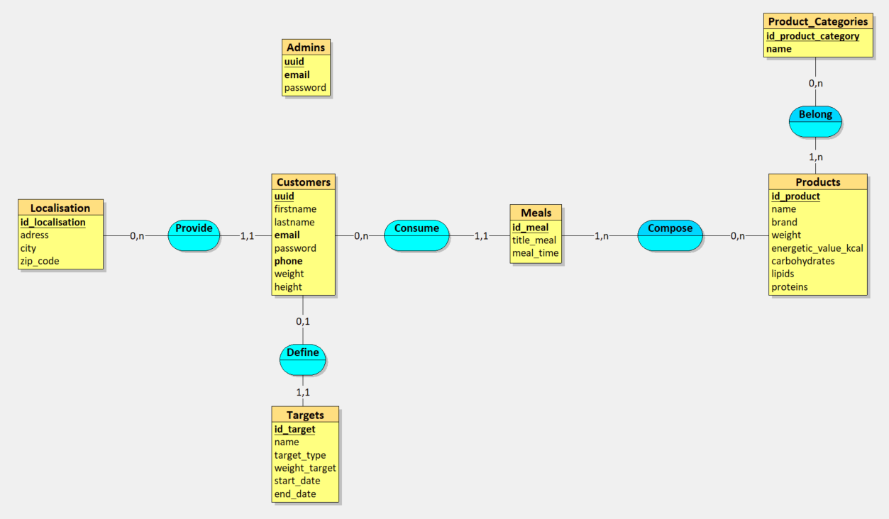
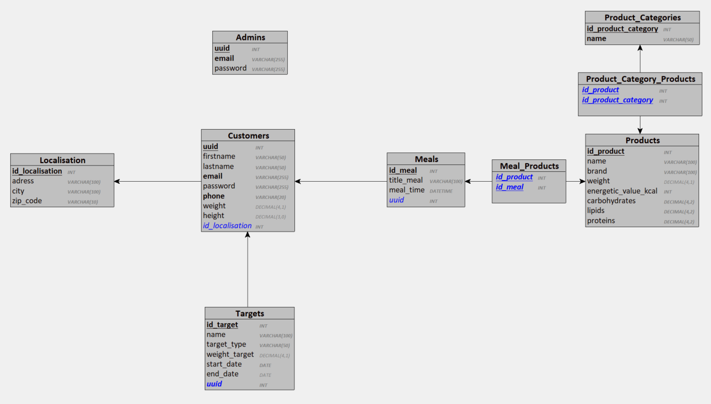

# Conception base de données

## MCD



## MLD



## MPD

```sql
CREATE TABLE Products(
   id_product INT,
   name VARCHAR(100) NOT NULL,
   brand VARCHAR(100) NOT NULL,
   weight DECIMAL(4,1),
   energetic_value_kcal INT NOT NULL,
   carbohydrates DECIMAL(4,2) NOT NULL,
   lipids DECIMAL(4,2) NOT NULL,
   proteins DECIMAL(4,2) NOT NULL,
   PRIMARY KEY(id_product)
);

CREATE TABLE Product_Categories(
   id_product_category INT,
   name VARCHAR(50) NOT NULL,
   PRIMARY KEY(id_product_category),
   UNIQUE(name)
);

CREATE TABLE Localisation(
   id_localisation INT,
   adress VARCHAR(100) NOT NULL,
   city VARCHAR(100) NOT NULL,
   zip_code VARCHAR(10) NOT NULL,
   PRIMARY KEY(id_localisation)
);

CREATE TABLE Customers(
   uuid INT,
   firstname VARCHAR(50) NOT NULL,
   lastname VARCHAR(50) NOT NULL,
   email VARCHAR(255) NOT NULL,
   password VARCHAR(255) NOT NULL,
   phone VARCHAR(20),
   weight DECIMAL(4,1),
   height DECIMAL(3,0),
   id_localisation INT NOT NULL,
   PRIMARY KEY(uuid),
   UNIQUE(email),
   UNIQUE(phone),
   FOREIGN KEY(id_localisation) REFERENCES Localisation(id_localisation)
);

CREATE TABLE Meals(
   id_meal INT,
   title_meal VARCHAR(100) NOT NULL,
   meal_time DATETIME NOT NULL,
   uuid INT NOT NULL,
   PRIMARY KEY(id_meal),
   FOREIGN KEY(uuid) REFERENCES Customers(uuid)
);

CREATE TABLE Targets(
   id_target INT,
   name VARCHAR(100) NOT NULL,
   target_type VARCHAR(50) NOT NULL,
   weight_target DECIMAL(4,1),
   start_date DATE NOT NULL,
   end_date DATE,
   uuid INT NOT NULL,
   PRIMARY KEY(id_target),
   UNIQUE(uuid),
   FOREIGN KEY(uuid) REFERENCES Customers(uuid)
);

CREATE TABLE Meal_Products(
   id_product INT,
   id_meal INT,
   PRIMARY KEY(id_product, id_meal),
   FOREIGN KEY(id_product) REFERENCES Products(id_product),
   FOREIGN KEY(id_meal) REFERENCES Meals(id_meal)
);

CREATE TABLE Product_Category_Products(
   id_product INT,
   id_product_category INT,
   PRIMARY KEY(id_product, id_product_category),
   FOREIGN KEY(id_product) REFERENCES Products(id_product),
   FOREIGN KEY(id_product_category) REFERENCES Product_Categories(id_product_category)
);
```

## Dictionnaire de données

| Entité                        | Attribut             | Type de Données | Longueur | Contraintes                                                                                                                       | Description                                    | Exemple             |
| ----------------------------- | -------------------- | --------------- | -------- | --------------------------------------------------------------------------------------------------------------------------------- | ---------------------------------------------- | ------------------- |
| **Products**                  | id_product           | INT             | -        | PRIMARY KEY                                                                                                                       | Identifiant unique du produit.                 | 1                   |
|                               | name                 | VARCHAR         | 100      | NOT NULL                                                                                                                          | Nom du produit.                                | Apple               |
|                               | brand                | VARCHAR         | 100      | NOT NULL                                                                                                                          | Marque du produit.                             | Fresh Farm          |
|                               | weight               | DECIMAL         | 4,1      | -                                                                                                                                 | Poids du produit en grammes.                   | 200.0               |
|                               | energetic_value_kcal | INT             | -        | NOT NULL                                                                                                                          | Valeur énergétique du produit en kcal.         | 52                  |
|                               | carbohydrates        | DECIMAL         | 4,2      | NOT NULL                                                                                                                          | Quantité de glucides en grammes.               | 14.0                |
|                               | lipids               | DECIMAL         | 4,2      | NOT NULL                                                                                                                          | Quantité de lipides en grammes.                | 0.2                 |
|                               | proteins             | DECIMAL         | 4,2      | NOT NULL                                                                                                                          | Quantité de protéines en grammes.              | 0.3                 |
| **Product_Categories**        | id_product_category  | INT             | -        | PRIMARY KEY                                                                                                                       | Identifiant unique de la catégorie de produit. | 1                   |
|                               | name                 | VARCHAR         | 50       | NOT NULL, UNIQUE                                                                                                                  | Nom de la catégorie de produit.                | Fruits              |
| **Localisation**              | id_localisation      | INT             | -        | PRIMARY KEY                                                                                                                       | Identifiant unique de la localisation.         | 1                   |
|                               | adress               | VARCHAR         | 100      | NOT NULL                                                                                                                          | Adresse de la localisation.                    | 123 Main St         |
|                               | city                 | VARCHAR         | 100      | NOT NULL                                                                                                                          | Ville de la localisation.                      | Paris               |
|                               | zip_code             | VARCHAR         | 10       | NOT NULL                                                                                                                          | Code postal de la localisation.                | 75001               |
| **Customers**                 | uuid                 | INT             | -        | PRIMARY KEY                                                                                                                       | Identifiant unique du client.                  | 1                   |
|                               | firstname            | VARCHAR         | 50       | NOT NULL                                                                                                                          | Prénom du client.                              | John                |
|                               | lastname             | VARCHAR         | 50       | NOT NULL                                                                                                                          | Nom de famille du client.                      | Doe                 |
|                               | email                | VARCHAR         | 255      | NOT NULL, UNIQUE                                                                                                                  | Adresse email du client.                       | john.doe@mail.com   |
|                               | password             | VARCHAR         | 255      | NOT NULL                                                                                                                          | Mot de passe du client.                        | securepass          |
|                               | phone                | VARCHAR         | 20       | UNIQUE                                                                                                                            | Numéro de téléphone du client.                 | 1234567890          |
|                               | weight               | DECIMAL         | 4,1      | -                                                                                                                                 | Poids du client en kg.                         | 70.0                |
|                               | height               | DECIMAL         | 3,0      | -                                                                                                                                 | Taille du client en cm.                        | 175                 |
|                               | id_localisation      | INT             | -        | NOT NULL, FOREIGN KEY(id_localisation) REFERENCES Localisation(id_localisation)                                                   | Référence à la localisation du client.         | 1                   |
| **Meals**                     | id_meal              | INT             | -        | PRIMARY KEY                                                                                                                       | Identifiant unique du repas.                   | 1                   |
|                               | title_meal           | VARCHAR         | 100      | NOT NULL                                                                                                                          | Titre du repas.                                | Breakfast           |
|                               | meal_time            | DATETIME        | -        | NOT NULL                                                                                                                          | Heure du repas.                                | 2023-01-01 08:00:00 |
|                               | uuid                 | INT             | -        | NOT NULL, FOREIGN KEY(uuid) REFERENCES Customers(uuid)                                                                            | Référence au client ayant consommé le repas.   | 1                   |
| **Targets**                   | id_target            | INT             | -        | PRIMARY KEY                                                                                                                       | Identifiant unique de l'objectif.              | 1                   |
|                               | name                 | VARCHAR         | 100      | NOT NULL                                                                                                                          | Nom de l'objectif.                             | Weight Loss         |
|                               | target_type          | VARCHAR         | 50       | NOT NULL                                                                                                                          | Type de l'objectif.                            | Weight              |
|                               | weight_target        | DECIMAL         | 4,1      | -                                                                                                                                 | Poids cible.                                   | 65.0                |
|                               | start_date           | DATE            | -        | NOT NULL                                                                                                                          | Date de début de l'objectif.                   | 2023-01-01          |
|                               | end_date             | DATE            | -        | -                                                                                                                                 | Date de fin de l'objectif.                     | 2023-12-31          |
|                               | uuid                 | INT             | -        | NOT NULL, UNIQUE, FOREIGN KEY(uuid) REFERENCES Customers(uuid)                                                                    | Référence au client ayant cet objectif.        | 1                   |
| **Meal_Products**             | id_product           | INT             | -        | PRIMARY KEY(id_product, id_meal), FOREIGN KEY(id_product) REFERENCES Products(id_product)                                         | Référence au produit dans le repas.            | 1                   |
|                               | id_meal              | INT             | -        | PRIMARY KEY(id_product, id_meal), FOREIGN KEY(id_meal) REFERENCES Meals(id_meal)                                                  | Référence au repas contenant le produit.       | 1                   |
| **Product_Category_Products** | id_product           | INT             | -        | PRIMARY KEY(id_product, id_product_category), FOREIGN KEY(id_product) REFERENCES Products(id_product)                             | Référence au produit dans la catégorie.        | 1                   |
|                               | id_product_category  | INT             | -        | PRIMARY KEY(id_product, id_product_category), FOREIGN KEY(id_product_category) REFERENCES Product_Categories(id_product_category) | Référence à la catégorie contenant le produit. | 1                   |
