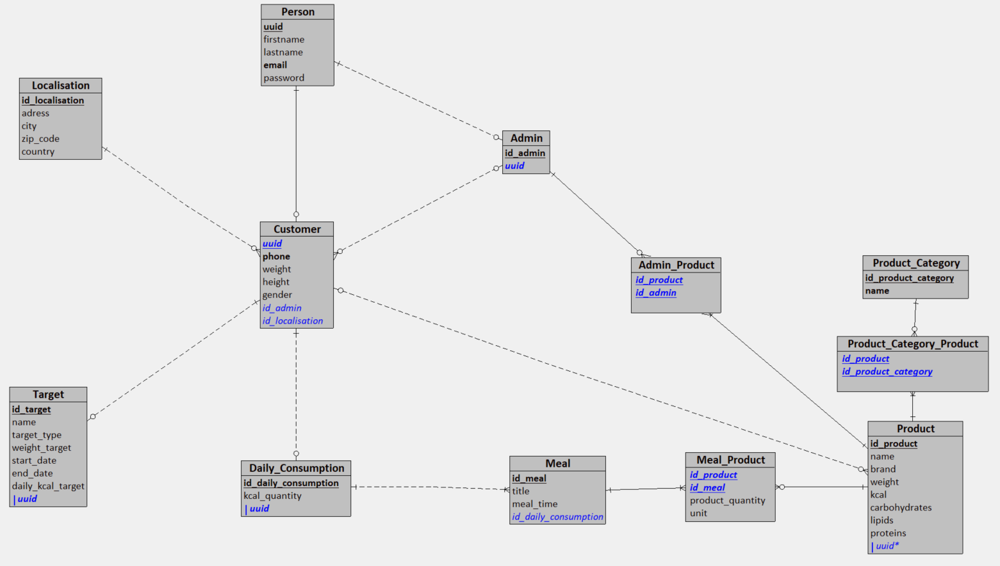

# Conception base de données

## MCD


## MLD



## MPD


```sql
CREATE TABLE Product (
   id_product SERIAL PRIMARY KEY,
   name VARCHAR(255) NOT NULL,
   brand VARCHAR(100),
   weight DECIMAL(5,1),
   kcal INT NOT NULL,
   carbohydrates DECIMAL(4,2),
   lipids DECIMAL(4,2),
   proteins DECIMAL(4,2)
);

CREATE TABLE Product_Categorie (
   id_product_category SERIAL PRIMARY KEY,
   name VARCHAR(50) NOT NULL UNIQUE
);

CREATE TABLE Localisation (
   id_localisation SERIAL PRIMARY KEY,
   adress VARCHAR(255) NOT NULL,
   city VARCHAR(255) NOT NULL,
   zip_code VARCHAR(20),
   country VARCHAR(50) NOT NULL
);

CREATE TABLE Person (
   uuid SERIAL PRIMARY KEY,
   firstname VARCHAR(100) NOT NULL,
   lastname VARCHAR(100) NOT NULL,
   email VARCHAR(255) NOT NULL UNIQUE,
   password VARCHAR(255) NOT NULL
);

CREATE TABLE Admin (
   id_admin SERIAL PRIMARY KEY,
   uuid INT NOT NULL UNIQUE,
   FOREIGN KEY(uuid) REFERENCES Person(uuid)
);

CREATE TABLE Customer (
   uuid INT PRIMARY KEY,
   phone VARCHAR(20) UNIQUE,
   weight DECIMAL(4,1) NOT NULL,
   height DECIMAL(3,0) NOT NULL,
   gender VARCHAR(10) NOT NULL,
   id_admin INT,
   id_localisation INT NOT NULL,
   FOREIGN KEY(uuid) REFERENCES Person(uuid),
   FOREIGN KEY(id_admin) REFERENCES Admin(id_admin),
   FOREIGN KEY(id_localisation) REFERENCES Localisation(id_localisation)
);

CREATE TABLE Target (
   id_target SERIAL PRIMARY KEY,
   name VARCHAR(100) NOT NULL,
   target_type VARCHAR(50) NOT NULL,
   weight_target DECIMAL(4,1) NOT NULL,
   start_date DATE NOT NULL,
   end_date DATE NOT NULL,
   daily_kcal_target INT,
   uuid INT NOT NULL UNIQUE,
   FOREIGN KEY(uuid) REFERENCES Customer(uuid)
);

CREATE TABLE Daily_Consumption (
   id_daily_consumption SERIAL PRIMARY KEY,
   kcal_quantity INT,
   uuid INT NOT NULL UNIQUE,
   FOREIGN KEY(uuid) REFERENCES Customer(uuid)
);

CREATE TABLE Meal (
   id_meal SERIAL PRIMARY KEY,
   title VARCHAR(100),
   meal_time TIMESTAMP NOT NULL,
   id_daily_consumption INT NOT NULL,
   FOREIGN KEY(id_daily_consumption) REFERENCES Daily_Consumption(id_daily_consumption)
);

CREATE TABLE Meal_Product (
   id_product INT,
   id_meal INT,
   product_quantity DECIMAL(5,1) NOT NULL,
   unit VARCHAR(10),
   PRIMARY KEY(id_product, id_meal),
   FOREIGN KEY(id_product) REFERENCES Product(id_product),
   FOREIGN KEY(id_meal) REFERENCES Meal(id_meal)
);

CREATE TABLE Product_Category_Product (
   id_product INT,
   id_product_category INT,
   PRIMARY KEY(id_product, id_product_category),
   FOREIGN KEY(id_product) REFERENCES Product(id_product),
   FOREIGN KEY(id_product_category) REFERENCES Product_Categorie(id_product_category)
);

CREATE TABLE Admin_Product (
   id_product INT,
   id_admin INT,
   PRIMARY KEY(id_product, id_admin),
   FOREIGN KEY(id_product) REFERENCES Product(id_product),
   FOREIGN KEY(id_admin) REFERENCES Admin(id_admin)
);

CREATE TABLE Customer_Product (
   uuid INT,
   id_product INT,
   PRIMARY KEY(uuid, id_product),
   FOREIGN KEY(uuid) REFERENCES Customer(uuid),
   FOREIGN KEY(id_product) REFERENCES Product(id_product)
);
```

## Dictionnaire de données

| Entité                   | Attribut             | Type de Données | Longueur | Contraintes                                  | Description                                                    | Exemple               |
|--------------------------|----------------------|-----------------|----------|----------------------------------------------|----------------------------------------------------------------|-----------------------|
| **Product**             | id_product           | INT             | -        | PRIMARY KEY                                  | Identifiant unique du produit.                                 | 1                     |
|                          | name                 | VARCHAR         | 255      | NOT NULL                                     | Nom du produit.                                                | Pomme                 |
|                          | brand                | VARCHAR         | 100      | -                                            | Marque du produit.                                             | Ferme Fraîche         |
|                          | weight               | DECIMAL         | 5,1      | -                                            | Poids du produit en grammes.                                   | 200.0                 |
|                          | kcal                 | INT             | -        | NOT NULL                                     | Valeur énergétique du produit en kcal.                         | 52                    |
|                          | carbohydrates        | DECIMAL         | 4,2      | -                                            | Quantité de glucides en grammes.                               | 14.0                  |
|                          | lipids               | DECIMAL         | 4,2      | -                                            | Quantité de lipides en grammes.                                | 0.2                   |
|                          | proteins             | DECIMAL         | 4,2      | -                                            | Quantité de protéines en grammes.                              | 0.3                   |
| **Product_Categorie**   | id_product_category  | INT             | -        | PRIMARY KEY                                  | Identifiant unique de la catégorie de produit.                 | 1                     |
|                          | name                 | VARCHAR         | 50       | NOT NULL, UNIQUE                             | Nom de la catégorie de produit.                                | Fruits                |
| **Localisation**         | id_localisation      | INT             | -        | PRIMARY KEY                                  | Identifiant unique de la localisation.                         | 1                     |
|                          | adress               | VARCHAR         | 255      | NOT NULL                                     | Adresse de la localisation.                                    | 123 Rue Principale    |
|                          | city                 | VARCHAR         | 255      | NOT NULL                                     | Ville de la localisation.                                      | Paris                 |
|                          | zip_code             | VARCHAR         | 20       | -                                            | Code postal de la localisation.                                | 75001                 |
|                          | country              | VARCHAR         | 50       | NOT NULL                                     | Pays de la localisation.                                       | France                |
| **Person**              | uuid                 | INT             | -        | PRIMARY KEY                                  | Identifiant unique de la personne.                             | 1                     |
|                          | firstname            | VARCHAR         | 100      | NOT NULL                                     | Prénom de la personne.                                         | Jean                  |
|                          | lastname             | VARCHAR         | 100      | NOT NULL                                     | Nom de famille de la personne.                                 | Dupont                |
|                          | email                | VARCHAR         | 255      | NOT NULL, UNIQUE                             | Adresse email de la personne.                                  | jean.dupont@mail.com  |
|                          | password             | VARCHAR         | 255      | NOT NULL                                     | Mot de passe de la personne.                                   | motdepasse            |
| **Admin**                | id_admin             | INT             | -        | PRIMARY KEY                                  | Identifiant unique de l'administrateur.                        | 1                     |
|                          | uuid                 | INT             | -        | NOT NULL, UNIQUE, FOREIGN KEY(uuid) REFERENCES Person(uuid) | Référence à la personne administrateur.                        | 1                     |
| **Customer**            | uuid                 | INT             | -        | PRIMARY KEY                                  | Identifiant unique du client.                                  | 1                     |
|                          | phone                | VARCHAR         | 20       | UNIQUE                                       | Numéro de téléphone du client.                                 | 0123456789            |
|                          | weight               | DECIMAL         | 4,1      | NOT NULL                                     | Poids du client en kg.                                         | 70.0                  |
|                          | height               | DECIMAL         | 3,0      | NOT NULL                                     | Taille du client en cm.                                        | 175                   |
|                          | gender               | VARCHAR         | 10       | NOT NULL                                     | Genre du client.                                               | Homme                 |
|                          | birth_date           | DATE            | -        | NOT NULL                                     | Date de naissance du client.                                   | 1990-01-01            |
|                          | id_admin             | INT             | -        | FOREIGN KEY(id_admin) REFERENCES Admin(id_admin) | Référence à l'administrateur responsable du client.            | 1                     |
|                          | id_localisation      | INT             | -        | NOT NULL, FOREIGN KEY(id_localisation) REFERENCES Localisation(id_localisation) | Référence à la localisation du client.            | 1                     |
| **Target**              | id_target            | INT             | -        | PRIMARY KEY                                  | Identifiant unique de l'objectif.                              | 1                     |
|                          | name                 | VARCHAR         | 100      | NOT NULL                                     | Nom de l'objectif.                                             | Perte de poids        |
|                          | target_type          | VARCHAR         | 50       | NOT NULL                                     | Type de l'objectif.                                            | Poids                 |
|                          | weight_target        | DECIMAL         | 4,1      | NOT NULL                                     | Poids cible.                                                   | 65.0                  |
|                          | start_date           | DATE            | -        | NOT NULL                                     | Date de début de l'objectif.                                   | 2023-01-01            |
|                          | end_date             | DATE            | -        | NOT NULL                                     | Date de fin de l'objectif.                                     | 2023-12-31            |
|                          | daily_kcal_target    | INT             | -        | -                                            | Objectif quotidien en kcal.                                    | 2000                  |
|                          | uuid                 | INT             | -        | NOT NULL, UNIQUE, FOREIGN KEY(uuid) REFERENCES Customer(uuid) | Référence au client ayant cet objectif.                        | 1                     |
| **Daily_Consumption**   | id_daily_consumption | INT             | -        | PRIMARY KEY                                  | Identifiant unique de la consommation quotidienne.             | 1                     |
|                          | kcal_quantity        | INT             | -        | -                                            | Quantité de kcal consommées dans la journée.                   | 1800                  |
|                          | uuid                 | INT             | -        | NOT NULL, UNIQUE, FOREIGN KEY(uuid) REFERENCES Customer(uuid) | Référence au client ayant cette consommation.                  | 1                     |
| **Meal**                | id_meal              | INT             | -        | PRIMARY KEY                                  | Identifiant unique du repas.                                   | 1                     |
|                          | title                | VARCHAR         | 100      | -                                            | Titre du repas.                                                | Petit-déjeuner        |
|                          | meal_time            | DATETIME        | -        | NOT NULL                                     | Heure du repas.                                                | 2023-01-01 08:00:00   |
|                          | id_daily_consumption | INT             | -        | NOT NULL, FOREIGN KEY(id_daily_consumption) REFERENCES Daily_Consumption(id_daily_consumption) | Référence à la consommation quotidienne liée au repas.         | 1                     |
| **Meal_Product**        | id_product           | INT             | -        | PRIMARY KEY(id_product, id_meal), FOREIGN KEY(id_product) REFERENCES Product(id_product) | Référence au produit dans le repas.                             | 1                     |
|                          | id_meal              | INT             | -        | PRIMARY KEY(id_product, id_meal), FOREIGN KEY(id_meal) REFERENCES Meal(id_meal) | Référence au repas contenant le produit.                        | 1                     |
|                          | product_quantity     | DECIMAL         | 5,1      | NOT NULL                                     | Quantité du produit dans le repas.                             | 100.0                 |
|                          | unit                 | VARCHAR         | 10       | -                                            | Unité de mesure de la quantité du produit.                     | g                     |
| **Product_Category_Product** | id_product      | INT             | -        | PRIMARY KEY(id_product, id_product_category), FOREIGN KEY(id_product) REFERENCES Product(id_product) | Référence au produit dans la catégorie.                        | 1                     |
|                          | id_product_category  | INT             | -        | PRIMARY KEY(id_product, id_product_category), FOREIGN KEY(id_product_category) REFERENCES Product_Categorie(id_product_category) | Référence à la catégorie contenant le produit. | 1                     |
| **Admin_Product**       | id_product           | INT             | -        | PRIMARY KEY(id_product, id_admin), FOREIGN KEY(id_product) REFERENCES Product(id_product) | Référence au produit géré par l'administrateur.                | 1                     |
|                          | id_admin             | INT             | -        | PRIMARY KEY(id_product, id_admin), FOREIGN KEY(id_admin) REFERENCES Admin(id_admin) | Référence à l'administrateur gérant le produit.                | 1                     |
| **Customer_Product**    | uuid                 | INT             | -        | PRIMARY KEY(uuid, id_product), FOREIGN KEY(uuid) REFERENCES Customer(uuid) | Référence au client ayant consommé le produit.                 | 1                     |
|                          | id_product           | INT             | -        | PRIMARY KEY(uuid, id_product), FOREIGN KEY(id_product) REFERENCES Product(id_product) | Référence au produit consommé par le client.      