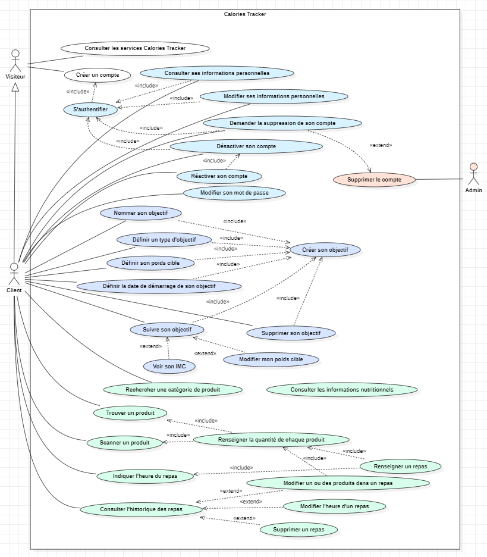

# Diagramme de cas d'utilisation

Le diagramme qui suit est découpé en plusieurs parties de l'application représentées par différentes couleurs :

- Blanc : Visite et inscription
- Bleu pale : Authentification et gestion des données personnelles
- Violet pale : Gestion et suivi de son objectif
- Vert clair : Gestion et suivi de ses repas
- Rouge pale : Suppression de compte par l'administrateur.

