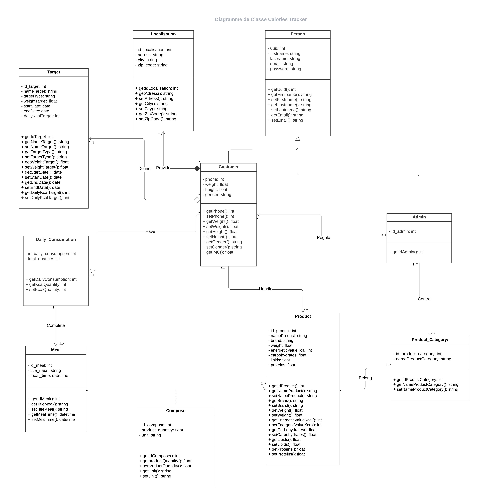

# Diagramme de classe

Le diagramme de classe présenté est destiné à une application de suivi des calories. Cette application permet aux utilisateurs de surveiller leur consommation alimentaire, de fixer des objectifs de poids, et de gérer les informations nutritionnelles des produits alimentaires.

